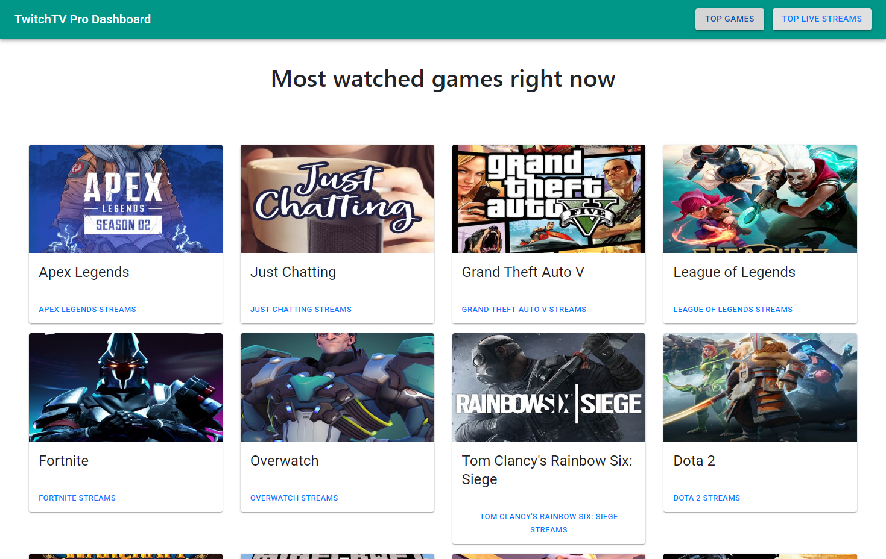
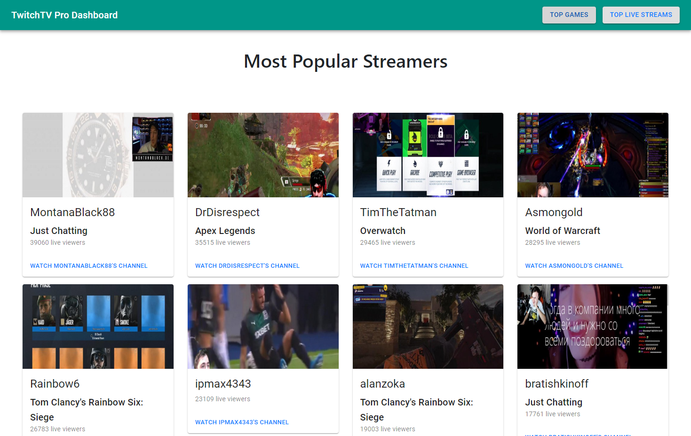
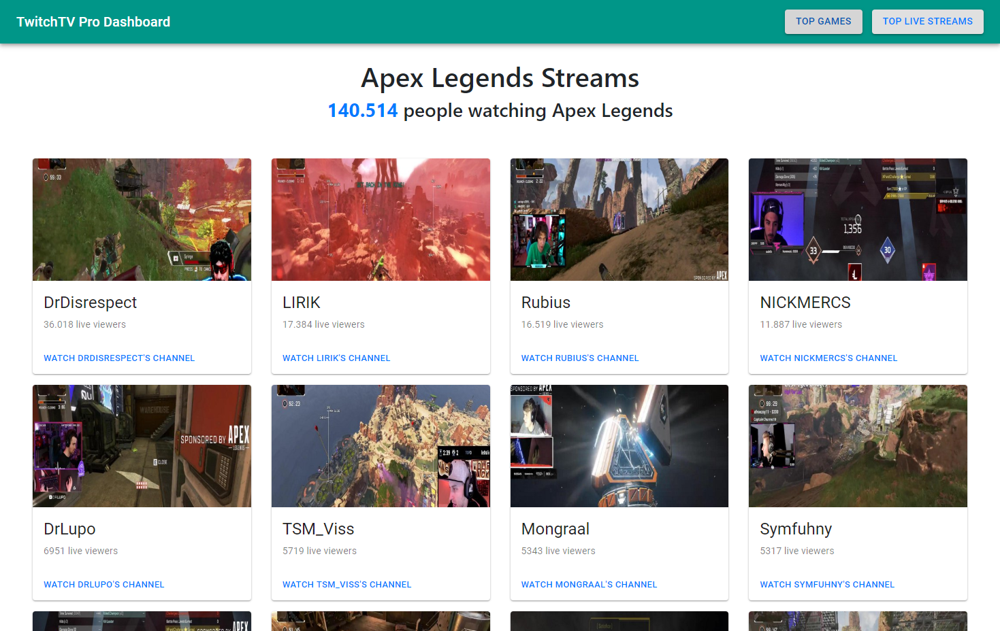

# TwitchTV Pro Dashboard
Pro Dashboard is a ReactJS web appplication that shows you the most viewed games and live streams on Twitch.tv

## Installation

Download the code from the repository, install it with npm by running the following command:

### `npm install`

And then just start the local React server by typing:

### `npm start`

## Screenshots:

## Technology Stack
In this project I have used ReactJS as the main front end framework, Axios for doing all the API calls and Material-UI and Bootstrap for styling the app.

## Contributing
All pull requests are welcome.

## License
[MIT](https://choosealicense.com/licenses/mit/)
